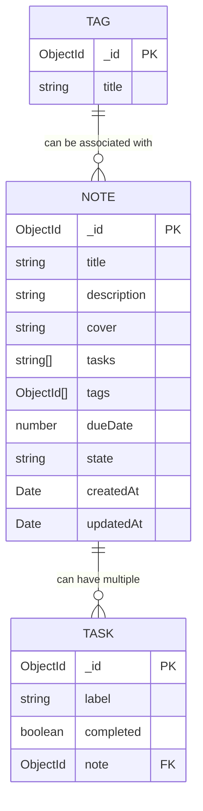

```mermaid
erDiagram
    TAG {
        ObjectId _id PK
        string title
    }

    NOTE {
        ObjectId _id PK
        string title
        string description
        string cover
        string[] tasks
        ObjectId[] tags
        number dueDate
        string state
        Date createdAt
        Date updatedAt
    }

    TASK {
        ObjectId _id PK
        string label
        boolean completed
        ObjectId note FK
    }

    TAG ||--o{ NOTE : "can be associated with"
    NOTE ||--o{ TASK : "can have multiple"
```
